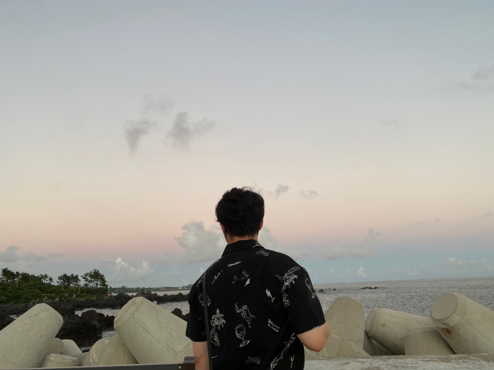

## 소개

1996.12.05 (27) / 서울특별시 서초구
#
**E-Mail** : intajon@gmail.com

## 학력

- `2015` 경민IT고등학교 정보통신과 졸업
- `2016` 한국IT직업전문학교 융합컴퓨터보안학과 입학
- `2021` 정보보호학 학사 학위 취득

## 기술 스택

## 자격증

- `2021` 정보처리기사
- `2021` 정보보안산업기사
- `2016` 네트워크관리사 2급
- `2016` 1종보통운전면허
- `2014` 전자계산기기능사
- `2012` 워드프로세서 1급

## 경력 사항

###  [`이루온아이앤에스`](http://www.eluonins.com) 시스템 엔지니어
2020.06 ~ 2022.01 (1년 6개월)
> - 스토리지 데이터 이전 • 전환 작업 (약 5억 건 이상 데이터)
> - 국회방송, 매일경제 등 통합 시스템 유지보수(스토리지 및 서버)
> - 서버, 스토리지 개선 사업 또는 신규 장비 도입 사업 참여

### `대한민국 육군` 정보보호병
2018.07 ~ 2020.03 (1년 8개월)
> - 정기 점검 스크립트(C#) 코드 리팩토링
> - 정보보호 체계 관제, 보호 정책 수립 및 적용
> - 육군 인트라넷 계정 관리 및 홈페이지 관리

### `Leantech` AR 어플리케이션 개발
2018.02 ~ 2018.07 (6개월)
 
> - Unity - Vuforia Engine을 통한 도면 타겟 AR 모델링
> - UGUI를 통한 UI 생성 및 가변 해상도 대응을 위한 반응형 설계
> - 홈페이지 가독성 및 번역 호환성을 위한 이미지 텍스트 치환
