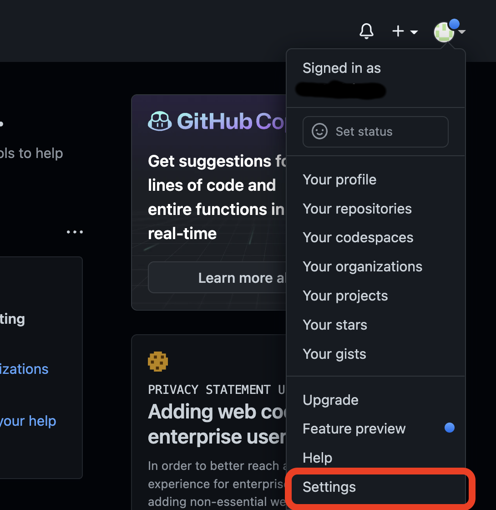
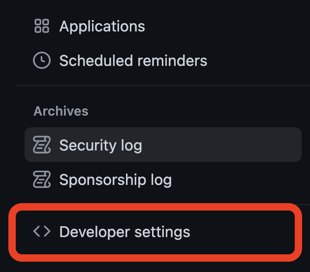
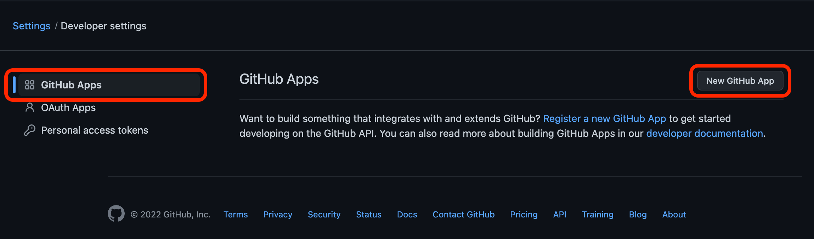
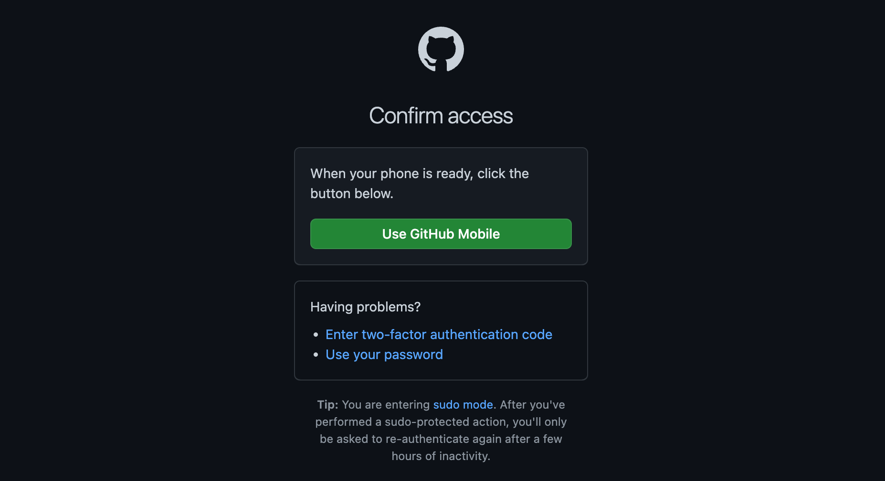
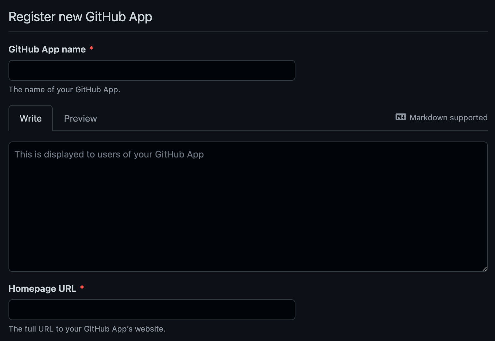
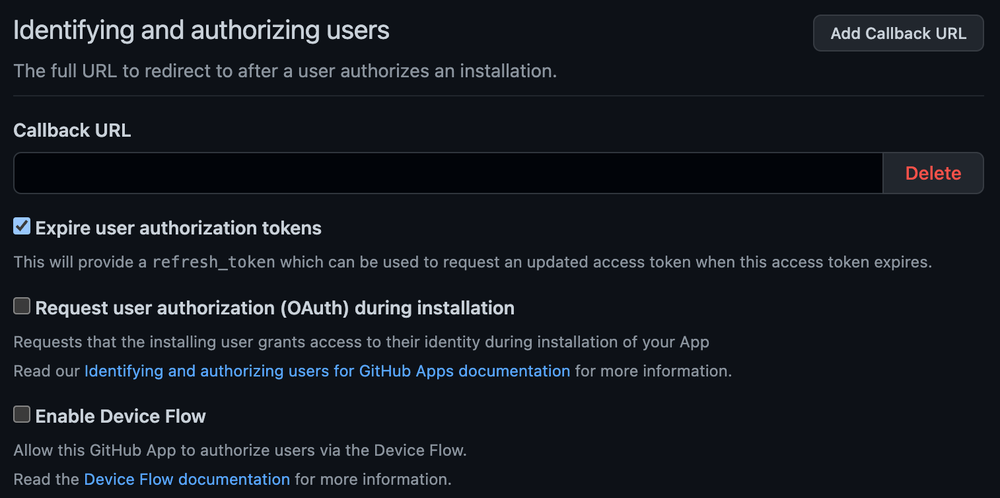
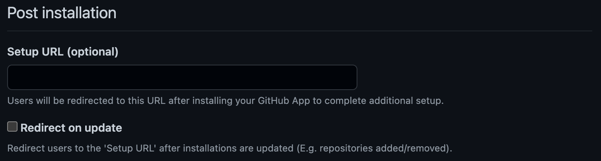
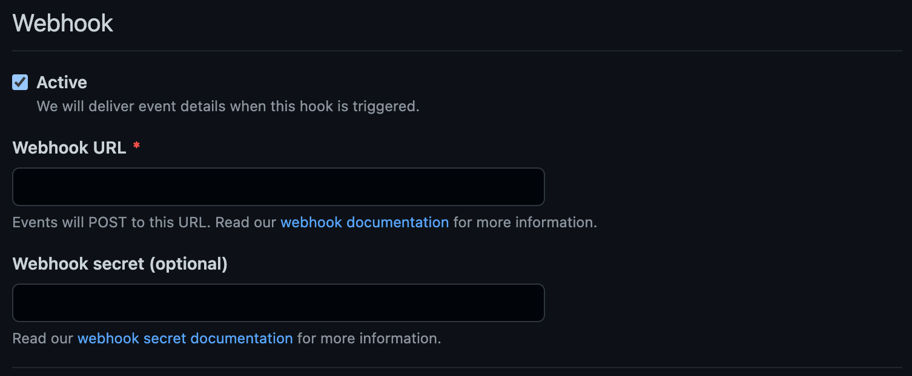

## Github Apps 란?
>GitHub API와 통합되는 프로젝트에서 GitHub 데이터에 접근하기 위한 세분화된 권한을 제공하기 때문에 GitHub에서 공식적으로 권장하는 Application 등록 방법입니다.
>
> GitHub App은 API를 통해 직접 작업을 수행하므로 별도의 봇 또는 서비스 계정이 필요하지 않습니다.

***[GitHub App과 OAuth App의 차이점](https://docs.github.com/en/developers/apps/differences-between-github-apps-and-oauth-apps)***

## Github Apps 생성하기
### GitHub 로그인
[GitHub Login](https://github.com/login) 페이지에서 로그인합니다.

### 설정 페이지 이동

GitHub 홈 화면에서 우측 상단 사용자 아이콘을 클릭 후 하단의 `Setting`를 클릭하면 설정 페이지로 이동됩니다.

이동 후, 좌측 메뉴 최하단의 `Developer settings` 를 클릭합니다.

Developer Setting 화면에서 좌측의 `GitHub Apps`를 클릭하고 `New GitHub App`을 클릭합니다.
Password 또는 2-Factor 인증, 또는 휴대폰 앱을 통한 인증을 진행하면 GitHub Apps 설정 화면으로 이동합니다.

### 세부 설정
> \* 표시가 붙어있는 항목은 필수 입력 항목입니다.

#### Register new GitHub App

- GitHub App Name : 생성할 GitHub App 이름 (기존 GitHub 계정과 동일한 이름 불가)
- This is displayed to users of your GitHub App : GitHub App에 대한 설명(마크다운 형식 지원)
- Homepage URL : 앱 웹사이트의 전체 URL
	- 특별히 해당 앱을 사용하는 사이트가 없는 경우 https://127.0.0.1 (루프백)등으로 입력

#### Identifying and authorizing users

- Callback URL : 사용자가 해당 앱을 승인한 후 리디렉션 될 URL
	- 이 URL은 앱이 사용자-서버 요청을 식별/승인해야 하는 경우 사용
	- `Add Callback URL` 을 통해 최대 10개의 추가 Callback URL을 사용 가능
- Expire user authorization : 액세스 토큰에 대한 만료 설정
	- 해당 옵션 선택 시 액세스 토큰이 만료될 때 업데이트된 토큰을 요청할 수 있는 refresh_token 제공 
	- [GitHub Docs - 사용자-서버 액세스 토큰 새로 고침](https://docs.github.com/en/apps/building-github-apps/refreshing-user-to-server-access-tokens)
- Request user ahtorization (OAuth) during installation : GitHub App에 사용자 권한 부여(OAuth)
	- 해당 옵션 활성화 시 Callback URL이 필수 입력 항목으로 전환되고, 아래 [Post Installation](#post-installation)의 Setup URL은 비활성화됨
	- GitHub App 생성 후 `Callback URL` 로 리디렉션 되면 `Callback Code` 를 Get 파라미터로 전달받게 되고 이것으로 액세스 토큰을 발급 후 API에 액세스
	- [GitHub Docs - Authorizing users during installation](https://docs.github.com/en/apps/installing-github-apps/#authorizing-users-during-installation)
- Enable Device Flow : CLI 도구 또는 Git 자격 증명 관리자와 같은 헤드리스 앱 권한 부여
	- [GitHub Docs - Device Flow](https://docs.github.com/en/developers/apps/building-oauth-apps/authorizing-oauth-apps#device-flow)

#### Post installation

- Setup URL : 추가 설정이 필요한 경우 GitHub App 구성 후 원하는 URL으로 리디렉션
	- 상단 [Identifying and authorizing users](#identifying-and-authorizing-users) 에서 `Request user ahtorization (OAuth) during installation` 체크 시 비활성화
- Redirect on update : GitHub App이 업데이트된 후 사용자를 `Setup URL` 로 리디렉션 (예: 리포지터리 추가/제거)

#### Webhook

- Active : 웹훅 활성화 설정
- Webhook URL : App에서 이벤트가 발생하는 경우 데이터를 받을 URL
- Webhook Secret : 원하는 사용자만 hook 을 받을 수 있도록 설정하는 선택적 보안 토큰

#### Repository permissions
> Permission(권한)은 총 3가지 상태로 지정할 수 있다.
>  - No Access : 허용하지 않음
>  - Read-only : 읽기만 허용
>  - Read and Write : 읽기/쓰기 허용

-   [**Actions**](https://docs.github.com/v3/apps/permissions/) : GitHub의 CI/CD 플랫폼인 GitHub Actions 관련 권한
-   [**Administration** ](https://docs.github.com/v3/apps/permissions/#permission-on-administration) : 리포지토리 생성, 삭제, 설정, 팀 및 Collaborators 관련 권한
-   [**Checks**](https://docs.github.com/v3/apps/permissions/#permission-on-checks) : 코드 검사 관련 권한
-   [**Code scanning alerts**](https://docs.github.com/v3/apps/permissions/) : 리포지토리의 보안 탭에 있는 코드 취약점 스캔 경고 관련 권한
-   [**Codespaces**](https://docs.github.com/v3/apps/permissions/) : GitHub 내장 IDE인 Codespace 생성, 편집, 삭제 등 관련 권한
-   [**Codespaces lifecycle admin**](https://docs.github.com/v3/apps/permissions/) : 특정 사용자에 대한 Codespace 시작/중지 등 lifecycle 관련 권한
-   [**Codespaces metadata**](https://docs.github.com/v3/apps/permissions/) : container 및 machine 등에 대한 Codespace 메타데이터 관련 권한
-   [**Codespaces secrets**](https://docs.github.com/v3/apps/permissions/) : Codespace에서 액세스할 수 있는 리포지토리에 대한 비밀 관련 권한
-   [**Commit statuses**](https://docs.github.com/v3/apps/permissions/#permission-on-statuses) : 커밋 상태 관련 권한
-   [**Contents**](https://docs.github.com/v3/apps/permissions/#permission-on-contents) : 리포지토리, 커밋, 브랜치, 다운로드, 릴리즈 및 병합 관련 권한
-   [**Dependabot alerts**](https://docs.github.com/v4/object/repositoryvulnerabilityalert/) : GitHub 종속성 관리 기능인 Dependabot의 경고 관련 권한
-   [**Dependabot secrets**](https://docs.github.com/v3/apps/permissions/) : Dependabot의 리포지토리 비밀 관련 권한
-   [**Deployments**](https://docs.github.com/v3/apps/permissions/#permission-on-deployments) : 배포 및 배포 상태 관련 권한
-   [**Discussions**](https://docs.github.com/v3/apps/permissions/) : 토론 및 의견, 레이블 관련 권한
-   [**Environments**](https://docs.github.com/v3/apps/permissions/) : 리포지토리 환경 변수 관련 권한
-   [**Issues**](https://docs.github.com/v3/apps/permissions/#permission-on-issues) : 이슈 관련 권한
-   [**Merge queues**](https://docs.github.com/v3/apps/permissions/) 리포지토리의 병합 대기열 관리 권한
-   [**Metadata**](https://docs.github.com/v3/apps/permissions/#metadata-permissions) : 리포지터리 검색, Collaborators 나열, 리포지토리 메타데이터 관련 권한
-   [**Packages**](https://docs.github.com/v3/apps/permissions/#permission-on-packages) : GitHub 패키지 플랫폼 관련 권한
-   [**Pages**](https://docs.github.com/v3/apps/permissions/#permission-on-pages) : 정적 웹 호스팅 서비스 Github Pages 관련 권한
-   [**Projects**](https://docs.github.com/v3/apps/permissions/#permission-on-repository-projects) : Github Projects 기능의 열 및 카드 관련 권한
-   [**Pull requests**](https://docs.github.com/v3/apps/permissions/#permission-on-pull-requests) : Pull Request 기능 관련 권한
-   [**Secret scanning alerts**](https://docs.github.com/v3/apps/permissions/) : 비밀 스캔 알림 관련 권한
-   [**Secrets**](https://docs.github.com/v3/apps/permissions/) : 리포지토리 비밀 관련 권한
-   [**Single file**](https://docs.github.com/v3/apps/permissions/#permission-on-single-file) : 하나의 파일만 관리하는 권한(..??)
-   [**Webhooks**](https://docs.github.com/v3/apps/permissions/#permission-on-repository-hooks) : 웹훅 관련 권한
-   [**Workflows**](https://docs.github.com/v3/apps/permissions/) : GitHub Actions Workflow 파일 업데이트 관련 권한

#### Organization permissions
-   [**Administration**](https://docs.github.com/v3/apps/permissions/#permission-on-organization-administration) : 조직에 대한 액세스 관리 권한
-   [**Blocking users**](https://docs.github.com/v3/apps/permissions/#permission-on-organization-user-blocking) : 사용자 차단 관련 권한
-   [**Events**](https://docs.github.com/v3/apps/permissions/#permission-on-organization-events) : 조직의 트리거된(?) 이벤트 관련 권한
-   [**Members**](https://docs.github.com/v3/apps/permissions/#permission-on-members) : 조직 구성원 및 팀 관련 권한
-   [**Organization codespaces**](https://docs.github.com/v3/apps/permissions/) : 조직의 Codespaces 관련 권한
-   [**Organization codespaces secrets**](https://docs.github.com/v3/apps/permissions/) : 조직의 Codespaces 비밀 관련 권한
-   [**Organization dependabot secrets**](https://docs.github.com/v3/apps/permissions/) : 조직의 Dependabot 비밀 관련 권한
-   [**Plan**](https://docs.github.com/v3/apps/permissions/) : 조직의 Plan(라이센스) 관련 권한
-   [**Projects**](https://docs.github.com/v3/apps/permissions/#permission-on-organization-projects) : 조직 프로젝트 관련 권한
-   [**Secrets**](https://docs.github.com/v3/apps/permissions/) : 조직의 Actions 비밀 관리 권한
-   [**Self-hosted runners**](https://docs.github.com/v3/apps/permissions/) : 조직에서 사용할 수 있는 Actions 자체 호스팅 실행자 관련 권한
-   [**Team discussions**](https://docs.github.com/v3/apps/permissions/#permission-on-team-discussions) : 팀 토론 및 관련 의견 관리 권한
-   [**Webhooks**](https://docs.github.com/v3/apps/permissions/#permission-on-organization-hooks) : 조직의 웹훅 관련 권한

#### User permissions
-   [**Block another user**](https://docs.github.com/v3/apps/permissions/#permission-on-blocking) : 사용자 차단 관련 권한
-   [**Codespaces user secrets**](https://docs.github.com/v3/apps/permissions/) : Codespace 비밀 관련 권한
-   [**Email addresses**](https://docs.github.com/v3/apps/permissions/#permission-on-emails) : 사용자의 이메일 주소 관련 권한
-   [**Followers**](https://docs.github.com/v3/apps/permissions/#permission-on-followers) : 사용자의 팔로워 관련 권한
-   [**GPG keys**](https://docs.github.com/v3/apps/permissions/#permission-on-gpg-keys) : 사용자의 GPG 키 관리 권한
-   [**Gists**](https://docs.github.com/v3/apps/permissions/) : 사용자의 GitHub Gists(코드, 메모, 로그 등 공유 기능) 관련 권한
-   [**Git SSH keys**](https://docs.github.com/v3/apps/permissions/#permission-on-keys) : Git을 통해 접근할 때에 사용되는 SSH 키 관련 권한
-   [**Interaction limits**](https://docs.github.com/v3/apps/permissions/#permission-on-interaction-limits) : 리포지토리 상호 작용 제한 권한
-   [**Plan**](https://docs.github.com/v3/apps/permissions/) : 사용자의 Plan(라이센스) 관련 권한
-   [**Profile**](https://docs.github.com/v3/apps/permissions/#permission-on-profile) : 사용자의 프로필 설정 관련 권한
-   [**Starring**](https://docs.github.com/v3/apps/permissions/#permission-on-starring) : 사용자가 Starring한 리포지토리 관련 권한
-   [**Watching**](https://docs.github.com/v3/apps/permissions/#permission-on-watching) : 사용자가 Watching하는 저장소 관련 권한

#### Subscribe to events
선택한 권한에 대해 구독할 이벤트를 선택합니다.
- Meta : 이 앱이 삭제되고 연결된 후크가 제거되는 경우
- Security Advisory : 보안 권고가 게시, 업데이트 또는 철회되는 경우

### 생성 완료
최초 생성 이후에는 상단에 노란 바탕으로 경고 메시지가 발생하게 되는데 생성한 GitHub App에 Private Key가 1개도 없기 때문에 발생하는 문제입니다.

하단의 Private keys 에서 `Generate a private key` 를 클릭해 Private Key를 하나 생성해주면 앱 사용 준비가 완료됩니다.

참고 자료 : https://docs.github.com/en/developers/apps/getting-started-with-apps/about-apps

