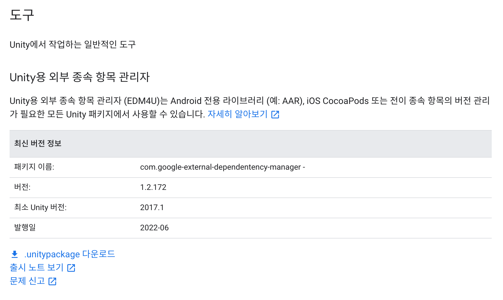

[Getting Started with the Facebook Unity SDK]([https://developers.facebook.com/docs/unity/gettingstarted](https://developers.facebook.com/docs/unity/gettingstarted))

## 유니티 패키지 설치
### Google Developers - Unity 외부 종속 항목 관리자
[Google Develpers](https://developers.google.com/unity/packages#tools)

- Google Developers 페이지에서 위와 같은 항목을 찾아 프로젝트에 Import

### Firebase Unity SDK - FirebaseAuth
[Facebook 로그인과 Unity를 사용하여 인증하기](https://firebase.google.com/docs/auth/unity/facebook-login?hl=ko)
#### Firebase
1. 새 앱 만들기
2. Authentication 등록 > Facebook

https://developers.facebook.com/docs/facebook-login/ios


# 우여곡절 정리부터
1. Firebase든 Facebook SDK든 사용하려고 하는데 Resolver가 동작하지 않았음(Resolver는 상단 구글링크에서 Unity 외부 종속 항목 관리자를 이용함.)
2. 오류를 찾다 보니 cocoapods 오류였고, 자료를 찾아보니 버전의 문제다 뭐다 했으나 일단 ruby의 버전이 2.6.10 이었고, ruby 버전을 업그레이드 하고 오류 메시지에 따라서 설정까지 지정
   https://pie001.github.io/entry/tech-note/0017/
   ``` bash
   gem install -n /usr/local/bin cocoapods
   ```
3. Build Settings 에서 enable bitcode 를 모두 비활성화
4. UnityFramework의 Build Phases > Link Binary With Libraries > `Accelerate.framework` 추가
5. 문제가 또 있다. Unable to install 이라는 오류가 출력되며 iOS에 앱이 절반만 설치되는듯한 증상이 있다.
   https://lxxyeon.tistory.com/147
   빌드 데이터를 Clean으로 날려주고, Provisioning Providerfmf 갱신하고 새로 빌드한 후에야 문제를 해결할 수 있었다.