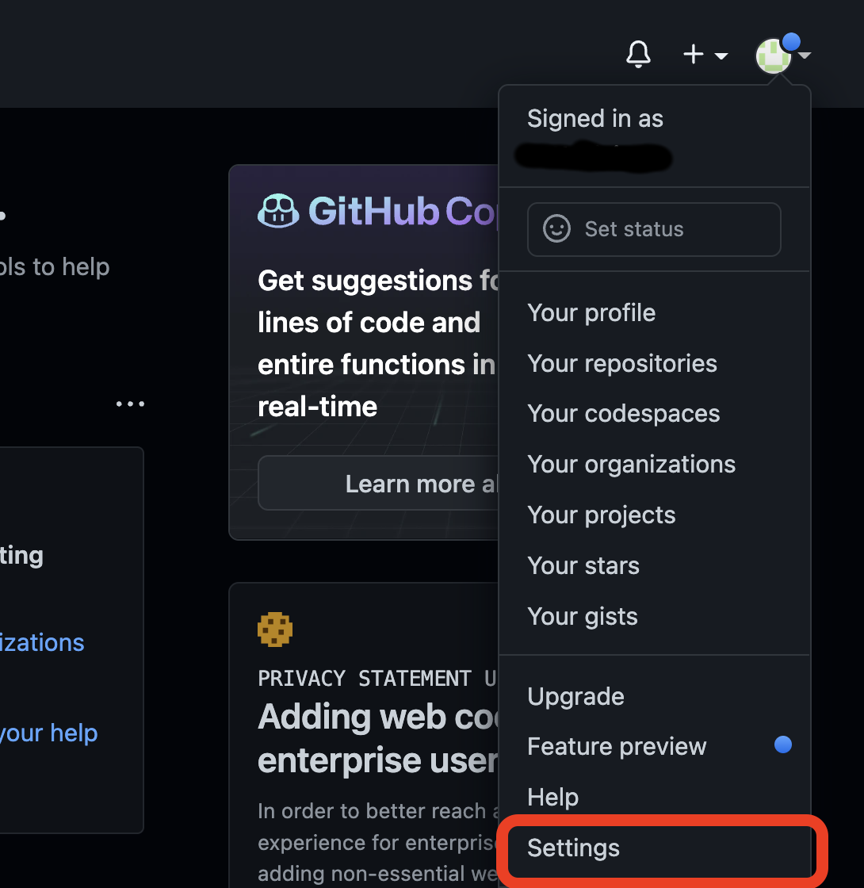

+++
author = "Dev-Woong"
title = "GitHub Personal Access Token 생성하기"
date = "2022-08-09"
description = "API 등에서 GitHub를 관리/제어할 수 있는 Personal Access Token 발급 방법을 알아봅니다."
tags = [
    "github",
    "Personal Access Token",
]
categories = [
    "GitHub",
]
series = ["GitHub Personal Access Token"]
aliases = ["migrate-from-jekyl"]
image = "code.jpg"
draft = true
+++

## Access Token 이란?

>GitHub에서는 HTTPS 에서의 ID/Password 인증 방식을 금지하고 Access Token 인증 방식으로 전환되었습니다. 
>
>Personal Access Token은 HTTPS 인증 시 Git의 암호 대신 사용하거나 API를 인증하는 데 사용할 수 있는 값 입니다.

---

## Personal Access Token 생성

### GitHub 로그인
[GitHub Login](https://github.com/login) 페이지에서 로그인합니다.

### Settings > Developer Settings



GitHub 홈 화면에서 우측 상단 사용자 아이콘을 클릭 후 하단의 `Setting`를 클릭하면 설정 페이지로 이동됩니다.

이동 후, 좌측 메뉴 최하단의 `Developer settings` 를 클릭합니다.


Developer Setting 화면에서 좌측의 `Personal access tokens`를 클릭하고 `Generate new token`을 클릭합니다.	

(작성자는 기존에 생성한 토큰이 한 개 있는 상태이므로 표시되는 화면이 다를 수 있습니다.)


* 토큰 이름 : 자유롭게 작성
* 만료 기간 : 자유롭게 선택하거나, 만료되지 않도록 설정
* 토큰 권한 : git 로그인 또는 API 사용 시에 필요한 만큼의 권한 할당

### Token 생성 완료

  
이제 생성한 토큰으로 HTTPS Url을 이용한 Clone 요청이나, GitHub의 여러 API(RestFul, GraphQL)등을 이용할 수 있습니다.


<!--
## Headings

The following HTML `<h1>`—`<h6>` elements represent six levels of section headings. `<h1>` is the highest section level while `<h6>` is the lowest.

# H1
## H2
### H3
#### H4
##### H5
###### H6

## Paragraph

Xerum, quo qui aut unt expliquam qui dolut labo. Aque venitatiusda cum, voluptionse latur sitiae dolessi aut parist aut dollo enim qui voluptate ma dolestendit peritin re plis aut quas inctum laceat est volestemque commosa as cus endigna tectur, offic to cor sequas etum rerum idem sintibus eiur? Quianimin porecus evelectur, cum que nis nust voloribus ratem aut omnimi, sitatur? Quiatem. Nam, omnis sum am facea corem alique molestrunt et eos evelece arcillit ut aut eos eos nus, sin conecerem erum fuga. Ri oditatquam, ad quibus unda veliamenimin cusam et facea ipsamus es exerum sitate dolores editium rerore eost, temped molorro ratiae volorro te reribus dolorer sperchicium faceata tiustia prat.

Itatur? Quiatae cullecum rem ent aut odis in re eossequodi nonsequ idebis ne sapicia is sinveli squiatum, core et que aut hariosam ex eat.

## Blockquotes

The blockquote element represents content that is quoted from another source, optionally with a citation which must be within a `footer` or `cite` element, and optionally with in-line changes such as annotations and abbreviations.

#### Blockquote without attribution

> Tiam, ad mint andaepu dandae nostion secatur sequo quae.
> **Note** that you can use *Markdown syntax* within a blockquote.

#### Blockquote with attribution

> Don't communicate by sharing memory, share memory by communicating.<br>
> — <cite>Rob Pike[^1]</cite>

[^1]: The above quote is excerpted from Rob Pike's [talk](https://www.youtube.com/watch?v=PAAkCSZUG1c) during Gopherfest, November 18, 2015.

## Tables

Tables aren't part of the core Markdown spec, but Hugo supports supports them out-of-the-box.

   Name | Age
--------|------
    Bob | 27
  Alice | 23

#### Inline Markdown within tables

| Italics   | Bold     | Code   |
| --------  | -------- | ------ |
| *italics* | **bold** | `code` |

| A                                                        | B                                                                                                             | C                                                                                                                                    | D                                                 | E                                                          | F                                                                    |
|----------------------------------------------------------|---------------------------------------------------------------------------------------------------------------|--------------------------------------------------------------------------------------------------------------------------------------|---------------------------------------------------|------------------------------------------------------------|----------------------------------------------------------------------|
| Lorem ipsum dolor sit amet, consectetur adipiscing elit. | Phasellus ultricies, sapien non euismod aliquam, dui ligula tincidunt odio, at accumsan nulla sapien eget ex. | Proin eleifend dictum ipsum, non euismod ipsum pulvinar et. Vivamus sollicitudin, quam in pulvinar aliquam, metus elit pretium purus | Proin sit amet velit nec enim imperdiet vehicula. | Ut bibendum vestibulum quam, eu egestas turpis gravida nec | Sed scelerisque nec turpis vel viverra. Vivamus vitae pretium sapien |

## Code Blocks

#### Code block with backticks

```html
<!doctype html>
<html lang="en">
<head>
  <meta charset="utf-8">
  <title>Example HTML5 Document</title>
</head>
<body>
  <p>Test</p>
</body>
</html>
```

#### Code block indented with four spaces

    <!doctype html>
    <html lang="en">
    <head>
      <meta charset="utf-8">
      <title>Example HTML5 Document</title>
    </head>
    <body>
      <p>Test</p>
    </body>
    </html>

#### Code block with Hugo's internal highlight shortcode

<!doctype html>
<html lang="en">
<head>
  <meta charset="utf-8">
  <title>Example HTML5 Document</title>
</head>
<body>
  <p>Test</p>
</body>
</html>


#### Diff code block

```diff
[dependencies.bevy]
git = "https://github.com/bevyengine/bevy"
rev = "11f52b8c72fc3a568e8bb4a4cd1f3eb025ac2e13"
- features = ["dynamic"]
+ features = ["jpeg", "dynamic"]
```

## List Types

#### Ordered List

1. First item
2. Second item
3. Third item

#### Unordered List

* List item
* Another item
* And another item

#### Nested list

* Fruit
  * Apple
  * Orange
  * Banana
* Dairy
  * Milk
  * Cheese

## Other Elements — abbr, sub, sup, kbd, mark

<abbr title="Graphics Interchange Format">GIF</abbr> is a bitmap image format.

H<sub>2</sub>O

X<sup>n</sup> + Y<sup>n</sup> = Z<sup>n</sup>

Press <kbd><kbd>CTRL</kbd>+<kbd>ALT</kbd>+<kbd>Delete</kbd></kbd> to end the session.

Most <mark>salamanders</mark> are nocturnal, and hunt for insects, worms, and other small creatures.

## Hyperlinked image

[](https://google.com)
-->
